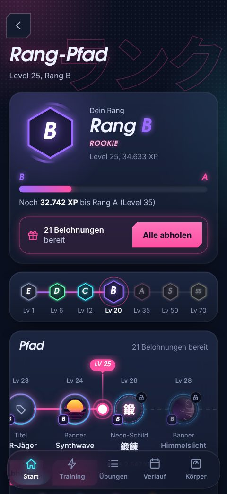
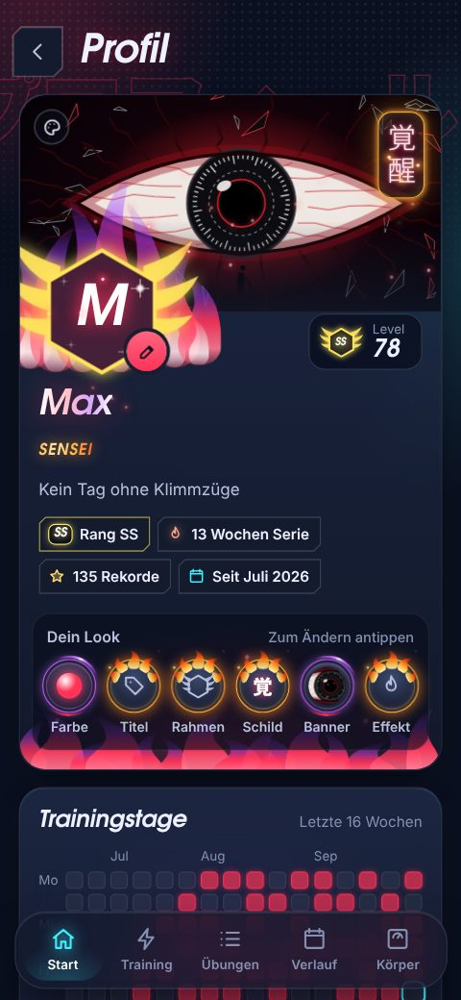

# KINTORE 筋トレ

Gym-Tracker für Android im Neon/Anime-Look.

  
  
  
  
  
  

## Download

Die neueste APK gibt es unter [Releases](../../releases/latest). Auf dem Handy öffnen und installieren.
Android warnt dabei vor einer unbekannten App, weil sie nicht aus dem Play Store kommt.
Neue Versionen einfach über die alte installieren, die Daten bleiben.

## Features

- Training mit Vorlagen (Pull, Push, Beine), Pausen-Timer und Notizen
- Steigerungs-Tipp nach Doppelprogression
- Rekorde mit PR-Animation, Level und Ränge von E bis SS
- Rang-Pfad mit Belohnungen zum Abholen: Neon-Farben, Titel, Rahmen, Neon-Schilder, Banner und Effekte
- Seltenheit von Normal bis Legendär, je nach Rang, aus dem eine Belohnung kommt
- XP nach Gewicht mit eigenem Maßstab pro Übung, so zählen Beinpresse und Curls gleich fair
- Profil mit großem Banner, Effekten über die ganze Karte, Abzeichen, Trainings-Kalender, Bestwerten und Sammlung
- Jeder Teil vom Look lässt sich direkt im Profil antippen und ändern, mit Vorschau
- 18 Banner, darunter dunkle Motive mit Tusche, Manga-Panel und Schwarzem Loch, ab Episch animiert
- Tages-Quest und Wochen-Serie mit Bonus-XP, Serien-Schutz für verpasste Wochen
- Diagramme und 1RM-Schätzung pro Übung, Scheibenrechner für die Langhantel
- Kalender, Körpergewicht, eigenes Hintergrundbild
- Backup und Import aus FitNotes
- Einfach zu bedienen: große Tippflächen, gut lesbar, größere System-Schrift, ruhige Animationen
  (aus mit "Animationen entfernen"), Regeln in [docs/bedienung.md](docs/bedienung.md)

## Selber bauen

Web-App (HTML, CSS, JS) in [Capacitor](https://capacitorjs.com). Jeder Push auf `main` baut über GitHub Actions
eine signierte APK. Dafür braucht der Build das Secret `KEYSTORE_PASSWORD`, wer das Projekt kopiert, braucht einen
eigenen Schlüssel.

Im Browser testen: `python3 -m http.server 8080 --directory www`

Die Screenshots zeigen Beispieldaten.
