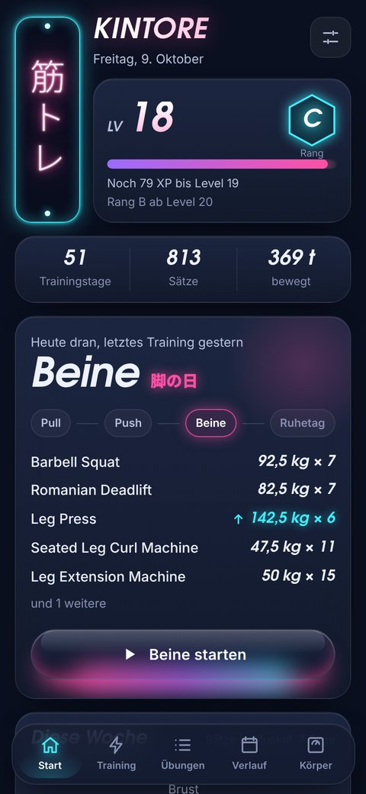
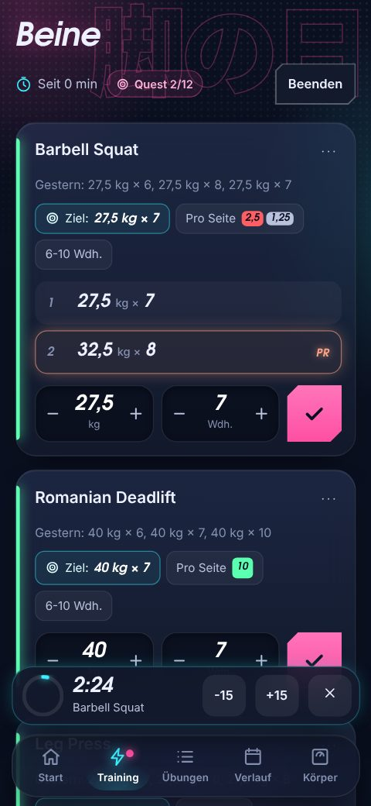
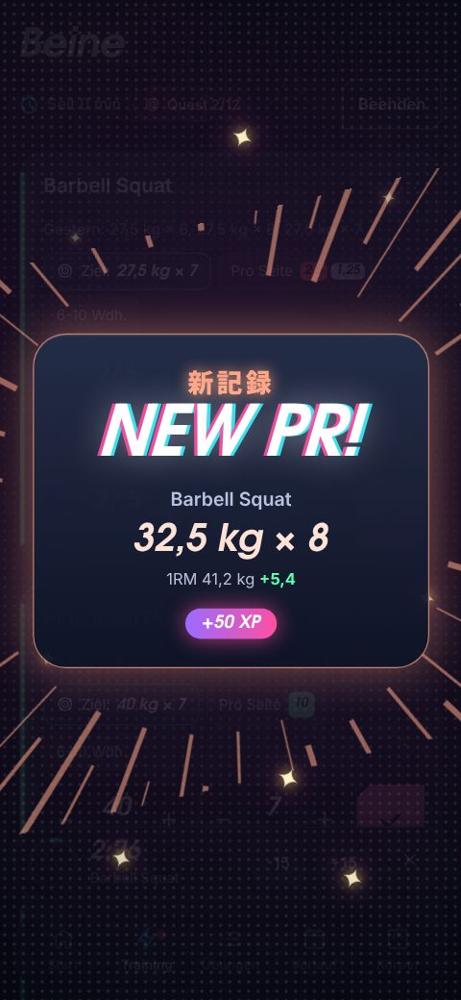
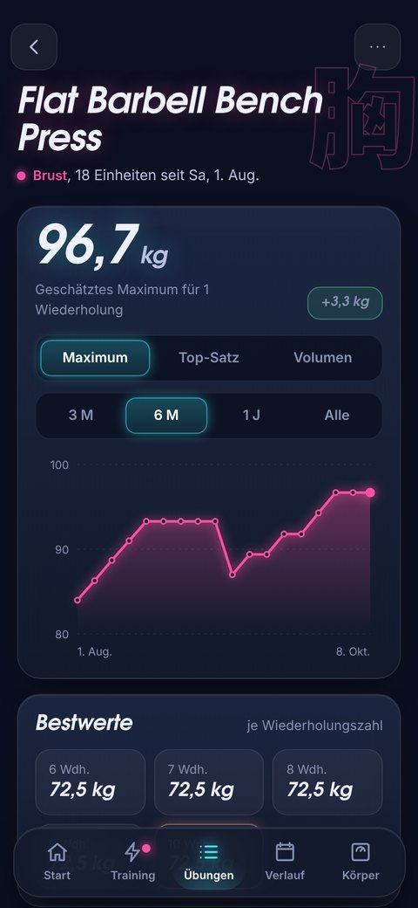

# KINTORE 筋トレ

Gym-Tracker für Android im Neon/Anime-Look.

  
  
  
  

## Download

Die neueste APK gibt es unter [Releases](../../releases/latest). Auf dem Handy öffnen und installieren.
Android warnt dabei vor einer unbekannten App, weil sie nicht aus dem Play Store kommt.
Neue Versionen einfach über die alte installieren, die Daten bleiben.

## Features

- Training mit Vorlagen (Pull, Push, Beine), Pausen-Timer und Notizen
- Steigerungs-Tipp nach Doppelprogression
- Rekorde mit PR-Animation, Level und Ränge
- Diagramme und 1RM-Schätzung pro Übung, Scheibenrechner für die Langhantel
- Kalender, Körpergewicht, eigenes Hintergrundbild
- Backup und Import aus FitNotes

## Selber bauen

Web-App (HTML, CSS, JS) in [Capacitor](https://capacitorjs.com). Jeder Push auf `main` baut über GitHub Actions
eine signierte APK. Dafür braucht der Build das Secret `KEYSTORE_PASSWORD`, wer das Projekt kopiert, braucht einen
eigenen Schlüssel.

Im Browser testen: `python3 -m http.server 8080 --directory www`

Die Screenshots zeigen Beispieldaten.
